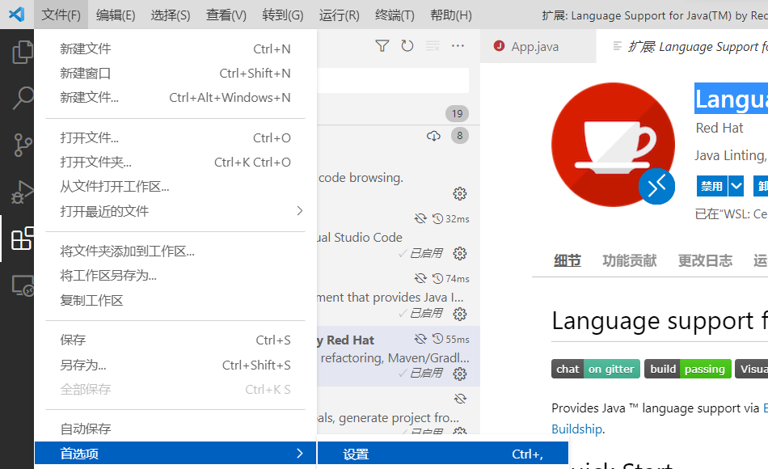
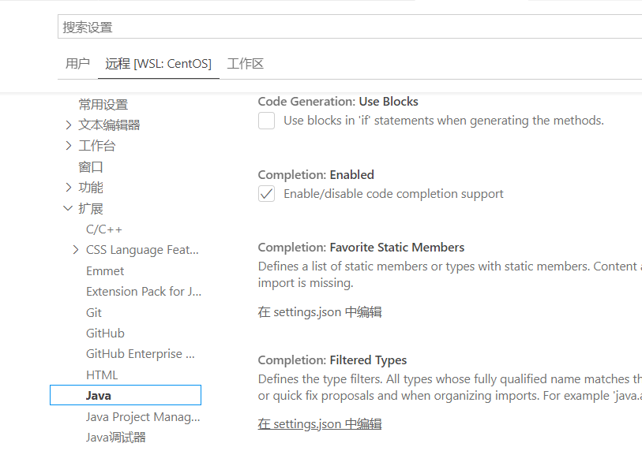

## vscode 配置java
配置过程
1. 在扩展中搜索“language support for java” 安装
2. 在扩展中搜索“Java Extension Pack” 安装
3. 将 Language Support for Java(TM) by Red Hat 安装另外一个版本 `v0.64.0` 
4. 文件->首选项->设置
5. 远程->拓展->java->在settings.json中编辑
6. settings.json配置如下
7.
``` json
{"java.configuration.runtimes": [
 {
 "name": "JavaSE-11",
 "path": "/usr/java/jdk1.8.0_171/",
 "default": true
 },
 ],
 "extensions.autoUpdate": false
}``` 
8. 存在问题：在centos中每个java项目需要单独设置.vscode文件
