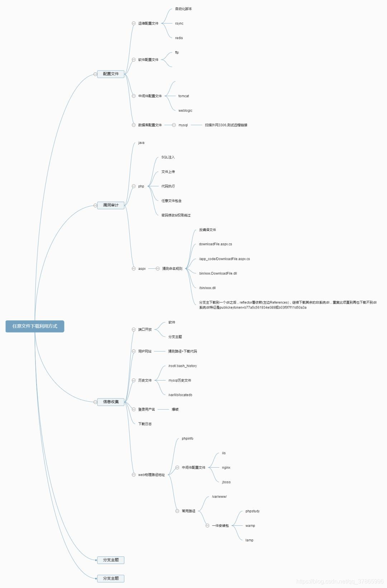

## LINUX下载目录
```

root/.ssh/authorized_keys如需登录到远程主机，需要到.ssh目录下，新建authorized_keys文件，并将id_rsa.pub内容复制进去
/root/.ssh/id_rsa//ssh私钥,ssh公钥是id_rsa.pub
/root/.ssh/id_ras.keystore//记录每个访问计算机用户的公钥
/root/.ssh/known_hosts //记录每个访问计算机用户的公钥
/etc/passwd
/etc/shadow//账户密码文件
/etc/my.cnf //mysql配置文件
/etc/httpd/conf/httpd.conf //apache配置文件
/root/.bash_history //用户历史命令记录文件
/root/.mysql_history //mysql历史命令记录文件
/proc/mounts //记录系统挂载设备
/porc/config.gz //内核配置文件
/var/lib/mlocate/mlocate.db //全文件路径
/porc/self/cmdline //当前进程的cmdline参数

```

[linux下载目录的补充](https://github.com/tutorial0/payloads/blob/master/lfi.txt)

## WINDOWS下载目录
```
C:\boot.ini //查看系统版本
C%3A%5Cboot.ini //URL编码
C:\Windows\System32\inetsrv\MetaBase.xml //IIS配置文件
C:\Windows\repair\sam //存储系统初次安装的密码
C:\Program Files\mysql\my.ini //Mysql配置
C:\Program Files\mysql\data\mysql\user.MYD //Mysql root
C:\Windows\php.ini //php配置信息
C:\Windows\my.ini //Mysql配置信息
C:\Windows\win.ini //Windows系统的一个基本系统配置文件
/WEB-INF/web.xml //Web应用程序配置文件
```

## 任意文件下载基础
网站提供文件(附件)下载的功能块，对下载的文件没有做限制，直接通过绝对路径对其文件进行下载，攻击者就可以利用这种方式下载服务器的敏感文件，对服务器进行进一步的威胁和攻击
## 利用方式
下载web源码我们可以获得数据库配置文件，然后可以通过远程数据库链接工具、在线数据库管理工具等链接获取数据库控制权。之后可以：
1. 拖库、篡改数据库
2. 获取数据库信息而一步攻击
3. 直接数据库提权
4. 可以通过分析源代码寻找漏洞，进行下一步攻击。
5. 
## 分类情况
1.件被解析，则是文件包含漏洞
2.显示源代码，则是文件查看漏洞
3.提示下载，则是文件下载漏洞
## 防御手段
-   下载路径不可控，而是程序自动生成后保存在数据库中，根据ID进行下载
-   对参数做严格的过滤，不能进行目录遍历（穿越）
